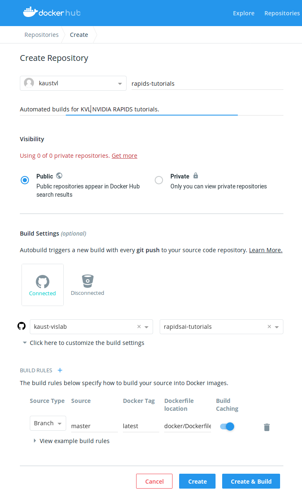

## Using the `kaustvl/nvidia-rapids-data-science-project` image

If you are not adding any additional dependencies to your project's `environment.yml` file, then you can run containers for your project based on the `kaustvl/nvidia-rapids-data-science-project` image hosted on DockerHub. Run the following command within your project's root directory to run a container for your project based on this existing Docker image.

```bash
$ docker container run \
  --rm \
  --tty \
  --volume ${pwd}/bin:/home/$USER/app/bin \
  --volume ${pwd}/data:/home/$USER/app/data \
  --volume ${pwd}/doc:/home/$USER/app/doc \
  --volume ${pwd}/notebooks:/home/$USER/app/notebooks \
  --volume ${pwd}/results:/home/$USER/app/results \
  --volume ${pwd}/src:/home/$USER/app/src \
  --runtime nvidia \
  --publish 8888:8888 \
  kaustvl/nvidia-rapids-data-science-project:latest
```

## Building a new image for your project

If you wish to add (remove) dependencies in your project's `environment.yml` (or if you wish to have a custom user defined inside the image), then you will need to build a new Docker image for you project. The following command builds a new image for your project with a custom `$USER` (with associated `$UID` and `$GID`) as well as a particular `$IMAGE_NAME` and `$IMAGE_TAG`. This command should be run within the `docker` sub-directory of the project.

```bash
$ docker image build \
  --build-arg username=$USER \
  --build-arg uid=$UID \
  --build-arg gid=$GID \
  --build-arg environment=environment.yml \
  --build-arg entrypoint=docker/entrypoint.sh \
  --file Dockerfile \
  --tag $IMAGE_NAME:$IMAGE_TAG \
  ../
```

### Automating the build process with DockerHub

1. Create a new (or login to your existing) [DockerHub](https://hub.docker.com) account.
2. [Link your GitHub account with your DockerHub account](https://docs.docker.com/docker-hub/builds/link-source/) (if you have not already done so).
3. Create a new DockerHub repository.
   1. Under "Build Settings" click the GitHub logo and then select your project's GitHub repository.
   2. Select "Click here to customize build settings" and specify the location of the Dockerfile for your build as `docker/Dockerfile`.
   3. Give the DockerHub repository the same name as your project's GitHub repository.
   4. Give the DockerHub repository a brief descrition (something like "Automated builds for $PROJECT" or similar).
   5. Click the "Create and Build" button.
4. Edit the `hooks/build` script with your project's `$USER`, `$UID`, and `$GID` build args in place of the corresponding default values.

Below is a screenshot which should give you an idea of how the form out to be filled out prior to clicking "Create and Build".



DockerHub is now configured to re-build your project's image whenever commits are pushed to your project's GitHub repository! Specifically, whenever you push new commits to your project's GitHub repository, GitHub will notify DockerHub and DockerHub will then run the `./hooks/build` script to re-build your project's image. For more details on the whole process see the [official documentation](https://docs.docker.com/docker-hub/builds/advanced/#build-hook-examples) on advanced DockerHub build options.

### Running a container

Once you have built the image, the following command will run a container based on the image `$IMAGE_NAME:$IMAGE_TAG`. This command should be run from within the project's root directory.

```bash
$ docker container run \
  --rm \
  --tty \
  --volume ${pwd}/bin:/home/$USER/app/bin \
  --volume ${pwd}/data:/home/$USER/app/data \ 
  --volume ${pwd}/doc:/home/$USER/app/doc \
  --volume ${pwd}/notebooks:/home/$USER/app/notebooks \
  --volume ${pwd}/results:/home/$USER/app/results \
  --volume ${pwd}/src:/home/$USER/app/src \
  --runtime nvidia \
  --publish 8888:8888 \
  $IMAGE_NAME:$IMAGE_TAG
```

### Using Docker Compose

It is quite easy to make a typo whilst writing the above docker commands by hand, a less error-prone approach is to use [Docker Compose](https://docs.docker.com/compose/). The above docker commands have been encapsulated into the `docker-compose.yml` configuration file. You will need to store your project specific values for `$USER`, `$UID`, and `$GID` in an a file called `.env` as follows. 

```
USER=$USER
UID=$UID
GID=$GID
```

For more details on how variable substitution works with Docker Compose, see the [official documentation](https://docs.docker.com/compose/environment-variables/#the-env-file).

Note that you can test your `docker-compose.yml` file by running the following command in the `docker` sub-directory of the project.

```bash
$ docker-compose config
```

This command takes the `docker-compose.yml` file and substitutes the values provided in the `.env` file and then returns the result.

Once you are confident that values in the `.env` file are being substituted properly into the `docker-compose.yml` file, the following command can be used to bring up a container based on your project's Docker image and launch the JupyterLab server. This command should also be run from within the `docker` sub-directory of the project.

```bash
$ docker-compose up --build
```

When you are done developing and have shutdown the JupyterLab server, the following command tears down the networking infrastructure for the running container.

```bash
$ docker-compose down
```
